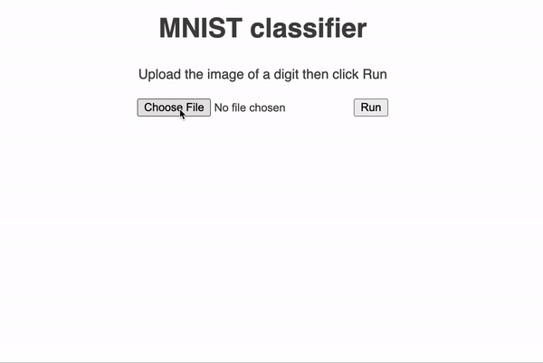

# Web interface for a MNIST classifier



A simple Flask web app to serve a MNIST classifier prediction hosted on Google Cloud Function

1. Check out [https://ngohgia.github.io/mnist-web](https://ngohgia.github.io/mnist-web) for setting up the model and required Google Cloud services.
2. Change the hardcoded variables `app.secret_key` and `app.config["QUERY_URL"]` in `app.py`. The secret key can be set to any random string to sign the session cookies. The query URL is the Google Cloud function HTTP endpoint set up in step 1.
2. Make sure you have Python 3 installed, then create and activate a new virtual environment:
```
python3 -m venv venv
source venv/bin/activate
```
3. Install the necessary packages with `pip install -r requirements.txt`
4. `flask run`
